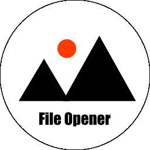
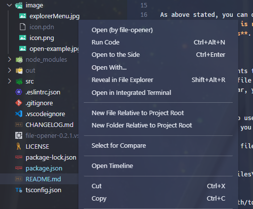
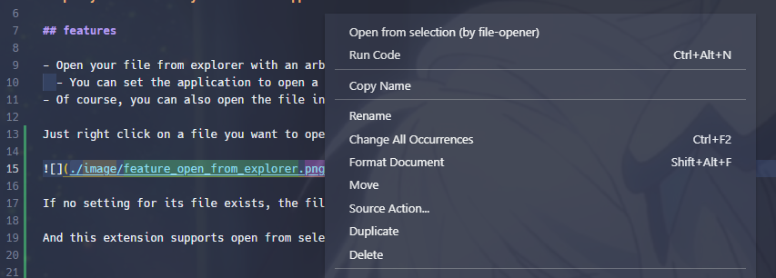
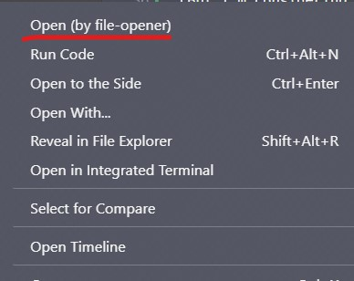
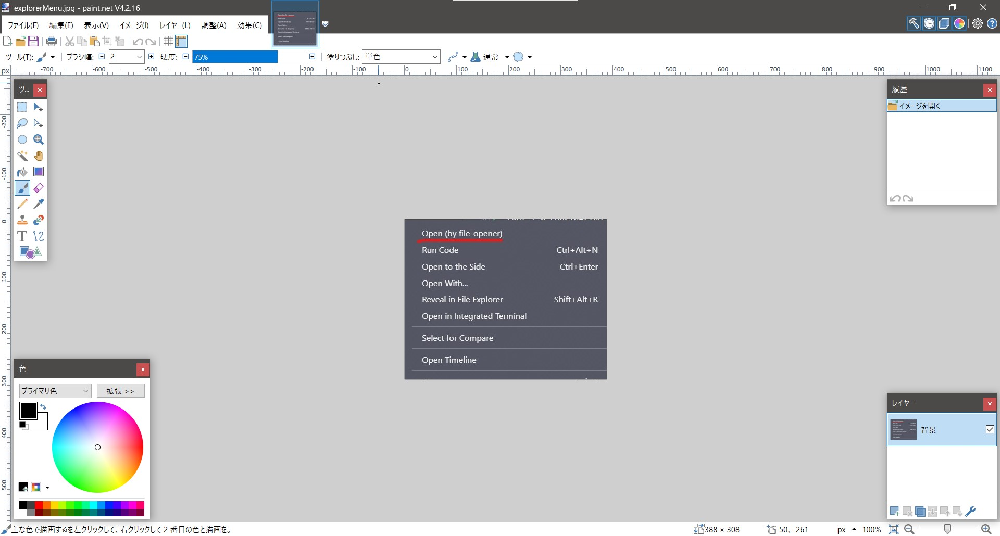

# file-opener



**Open your file with your favorite application.**

**For Windows only now.** 
If you are not Windows user, wait for this update for Mac and Linux.

## features

- Open your file from explorer with an arbitrary application.
  - You can set the application to open a file by the extension of it.
- Of course, you can also open the file in your default application.

Just right click on a file you want to open in another application and select `Open`!



If no setting for its file exists, the file will be opened by default application.

And this extension supports open from selection in editor!
Just select a file path to open, and right click and `Open from selection`!



## usage

You can open your file with your favorite application.
But **the application is required to be executed from command-line and support command-line arguments**.


**Tips**:
There is no requirements to open by default application.
Just right-click the file and click "open(by file-opener)."
Or if you make it clear, you can do it by setting the executorMap `null`.


For example, I want to use Paint.NET to open image files.
First, check the path you install it. In my case, it is "C:\Program Files\paint.net\paintDotNet.exe".
Second, try to open a file in your terminal with it:

```
C:\hoge>"C:\Program Files\paint.net\paintDotNet.exe" path/to/image.jpg
```

If you cannot open path/to/image.jpg, you cannot execute the application with this extension. Sorry.
In case the image file is successfully opened, there is no problem with this extension!

Now, let me assume that this extension accepts your favorite application.
To open .jpg files with paintDotNet.exe, add the association in settings.json.

```settings.json
"file-opener.executorMapByExtension": {
  ".jpg": "\"C:\\Program Files\\paint.net\\paintDotNet.exe\"",
},
```

Note that you must enclose the executor path in "\\"" if its path includes a folder whose name includes a blank.
(But I'm considering whether this extension always encloses its path.)

Right-click the file you want to open in explorer.


You can see "`Open (by file-opener)`" if this extension is successfully activated.
Let's click it.

Now I selected "explorerMenu.jpg" as I set ".jpg" in "`file-opener.executorMapByExtension`".
It might take just a little while to open.


Yes! I can open an image with paint.NET!

You can open other files by setting `file-opener.executorMapByExtension` properly. To get more information, see the next section.


## setting

There are some settings for conformability.
Let's see them.

### `file-opener.executorMapByExtension`

Executor maps by the extension of the file

If you open .png file with path/to/executor, you set it like below:

```settings.json
"file-opener.executorMapByExtension": {
  ".png": "path/to/executor",
},
```

Note that you must enclose the path in \\" if it includes a blank.
For example, let me assume that you want to use "C:\\users\\program files\\application\\app.exe" for its executor.
This path includes a blank in "program files" folder, so you enclose \\":

```settings.json
"file-opener.executorMapByExtension": {
  ".png": "\"C:\\users\\program files\\application\\app.exe\"",
},
```

Pay attention that you need to escape double-quotation-mark (") as usual.

### `file-opener.executorAliasDict`

Aliases for your executors.

I recommend using this setting like below:

```settings.json
"file-opener.executorAliasDict": {
  "paintDotNet": "\"C:\\Program Files\\paint.net\\paintDotNet.exe\""
},
"file-opener.executorMapByExtension": {
  ".png": "paintDotNet",
  ".jpeg": "paintDotNet",
  ".jpg": "paintDotNet",
  ".pdn": "paintDotNet"
},
```

This means if you open ".png" files, this extension uses "C:\\Program Files\\paint.net\\paintDotNet.exe" instead of "paintDotNet" in `executorMapByExtension`.
By using this setting, you can manage the paths of the applications in one place.

-- You may think what the benefits are.
OK, let me explain with a simple situation.

Suppose that you want to open ".jpg", ".png", ".jpeg" and ".svg" with the same application (and its path is "path/to/application").

In this case, what you want to do can be achieved with the following settings:

```settings.json
"file-opener.executorMapByExtension": {
  ".jpg": "path/to/application",
  ".jpeg": "path/to/application",
  ".png": "path/to/application",
  ".svg": "path/to/application",
  ...
},
```

One day, you think of changing to a new application whose path is "path/to/new-application"
So you must change settings.json like below:

```settings.json
"file-opener.executorMapByExtension": {
  ".jpg": "path/to/new-application",
  ".jpeg": "path/to/new-application",
  ".png": "path/to/new-application",
  ".svg": "path/to/new-application",
  ...
},
```

I don't think it is beautiful.
If you used `file-opener.executorAliasDict`, all you do would be just rewriting the alias path.
```settings.json
"file-opener.executorAliasDict": {
  // before: "image-application": "path/to/application"
  // just rewrote like below
  "image-application": "path/to/new-application"
},
"file-opener.executorMapByExtension": {
  ".jpg": "image-application",
  ".jpeg": "image-application",
  ".png": "image-application",
  ".svg": "image-application",
  ...
},
```

Let's try and enjoy comfortable VScode life!

### `file-opener.executeInTerminal`

If true, commands to open will be executed in VScode terminal.
defaults to false.

This extension usually uses child_process module provided by node.js.
So you can't check its input and output.
(If an error happens, you can check it in OUTPUT console in VSCode. But the console can show many garbled characters, especially Japanese, and so on.
If this extension doesn't work well, try to turn this setting into true.

## future works

- For Mac and Linux
- Set the application path by the regular expression
- ~~Open file from selection in editor~~
  - implement version 0.3.0

## changelog

see [CHANGELOG.md](./CHANGELOG.md)

## license

MIT License. See [LICENSE](LICENSE)
